# Diagram Types Reference

Comprehensive syntax and patterns for all supported Mermaid diagram types.
Use these as templates when generating diagrams.

---

## Flowchart (most common for tutorials)

The workhorse diagram type. Use for pipelines, processes, decision trees, and
any sequential or branching logic.

### Linear pipeline

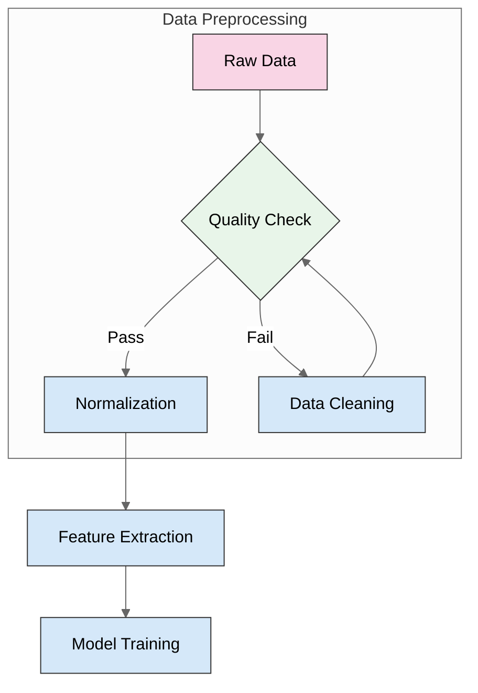

### Multi-stage pipeline (Pretraining to Alignment style)

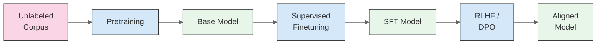

### Decision tree with Yes/No branches

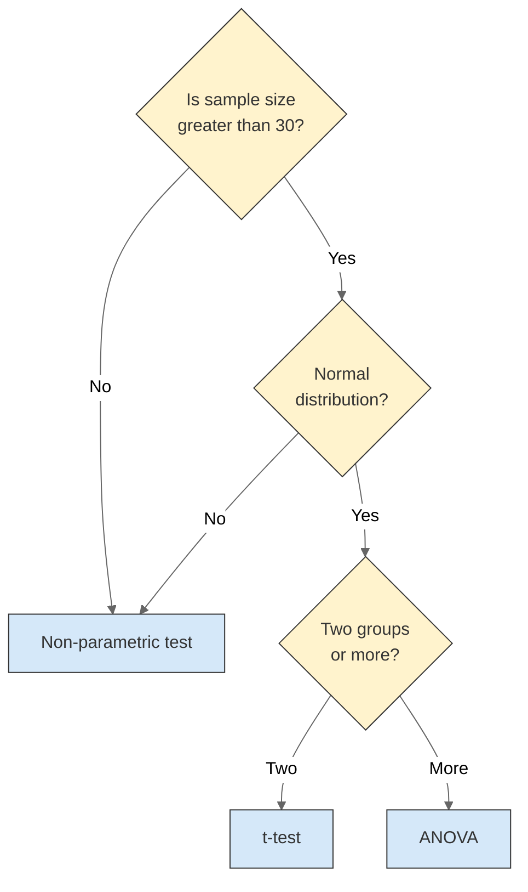

### Multi-path flow with parallel branches

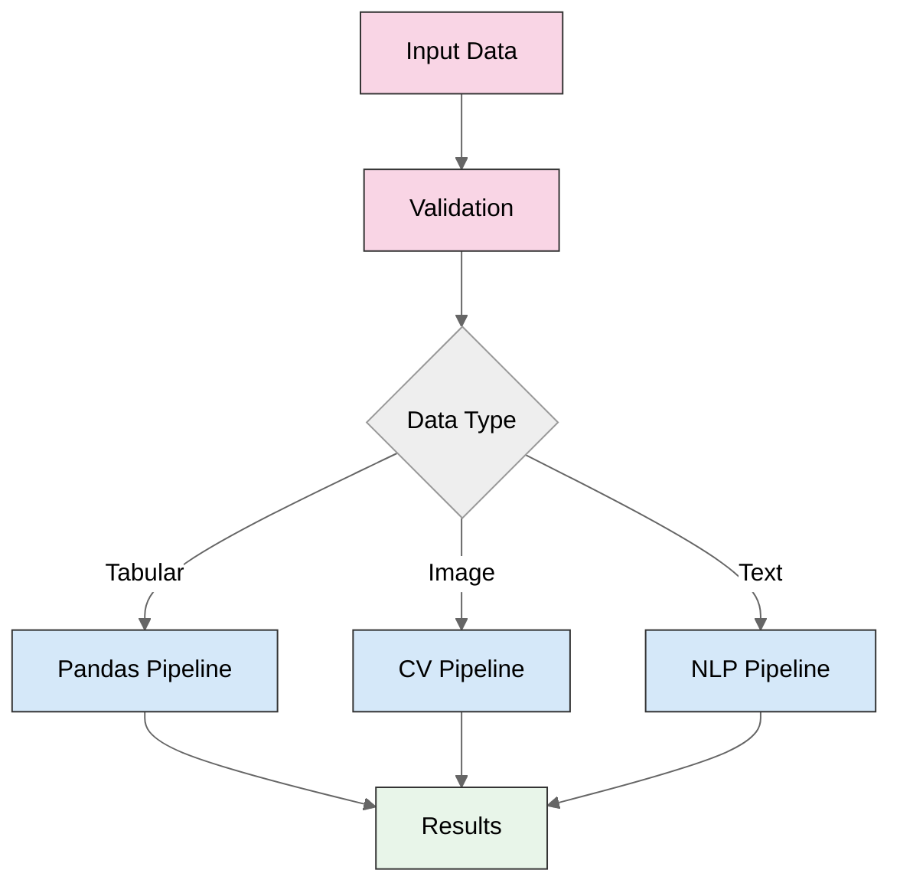

### Nested subgraphs for grouped components

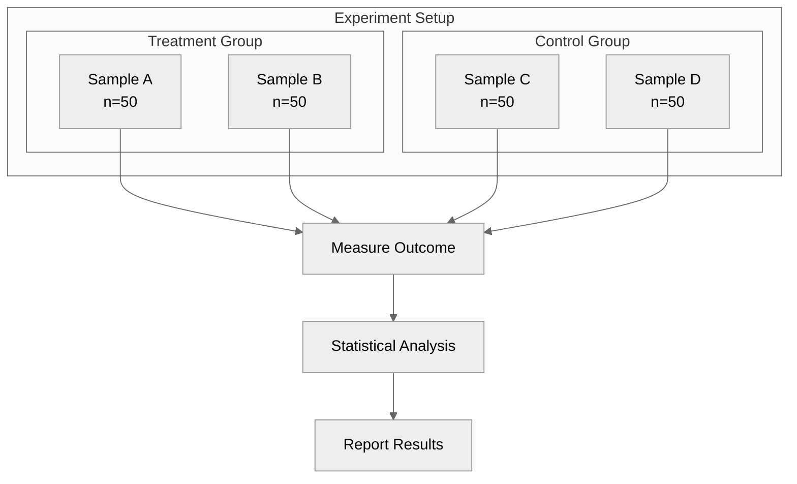

### Node shapes reference

```
[Rectangle]     — standard process
(Rounded)       — soft step
{Diamond}       — decision
([Stadium])     — terminal / start-end
[(Cylinder)]    — database / storage
[[Subroutine]]  — subprocess
((Circle))      — connector
>Asymmetric]    — input
{Hexagon}       — preparation (use {{Hexagon}})
```

---

## Sequence Diagram (protocols and interactions)

Best for: API calls, experimental protocols, message-passing systems.

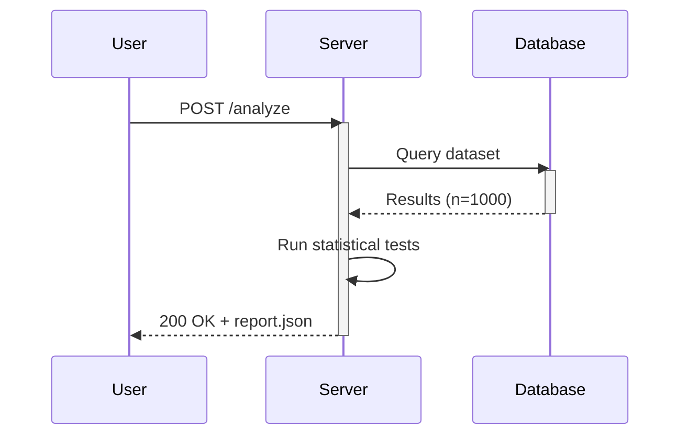

### With loops and conditionals

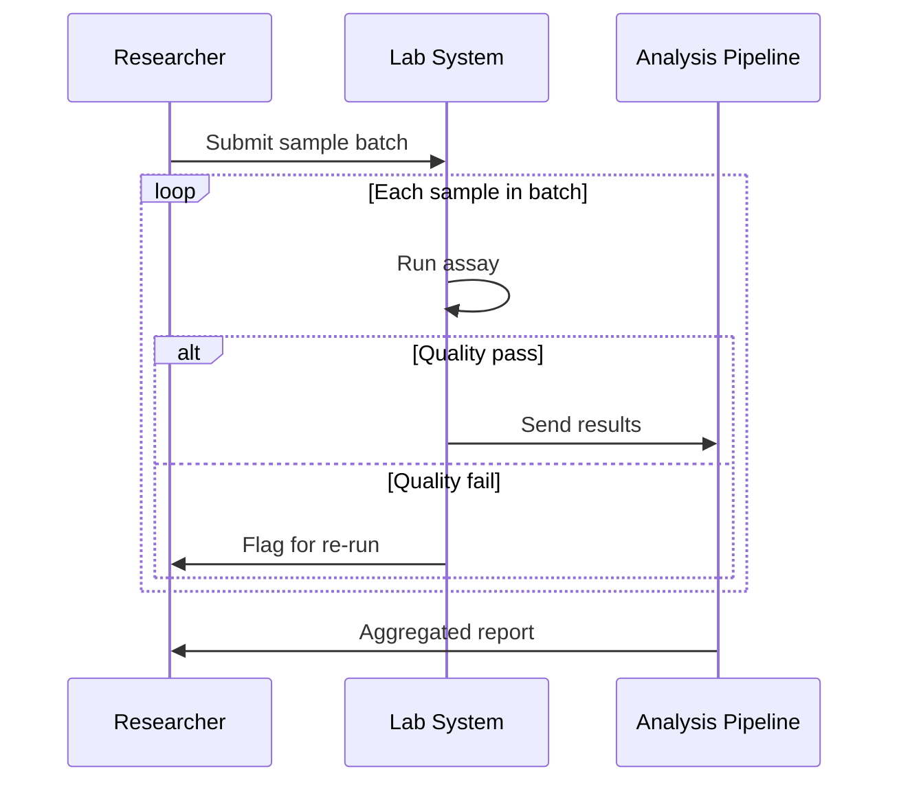

### Notes and highlighting

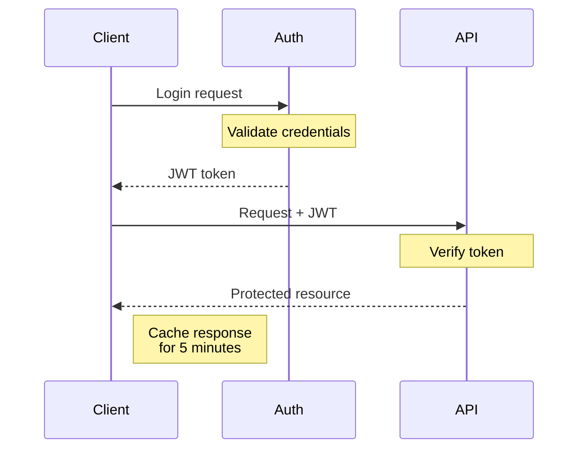

---

## Architecture Diagram (system overviews)

Use flowchart with subgraphs to create layered architecture views.

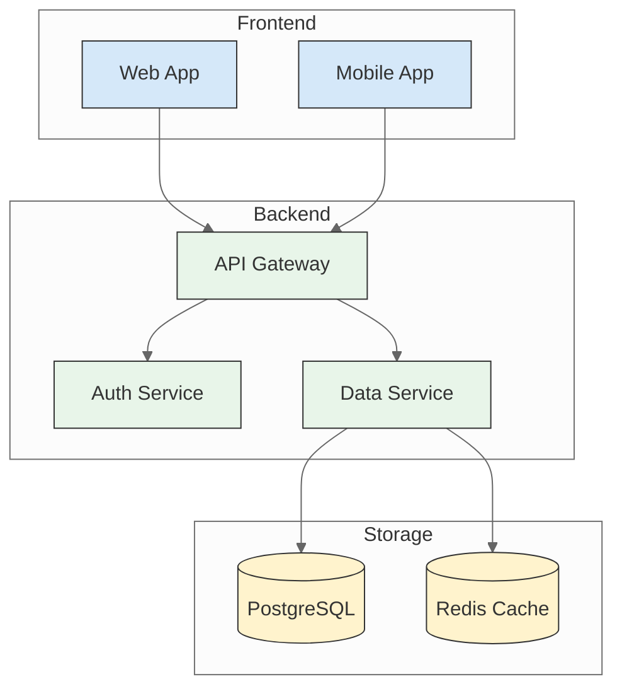

### ML system architecture

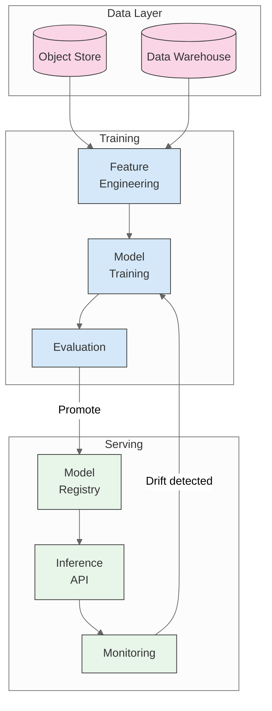

---

## Mind Map (concept exploration)

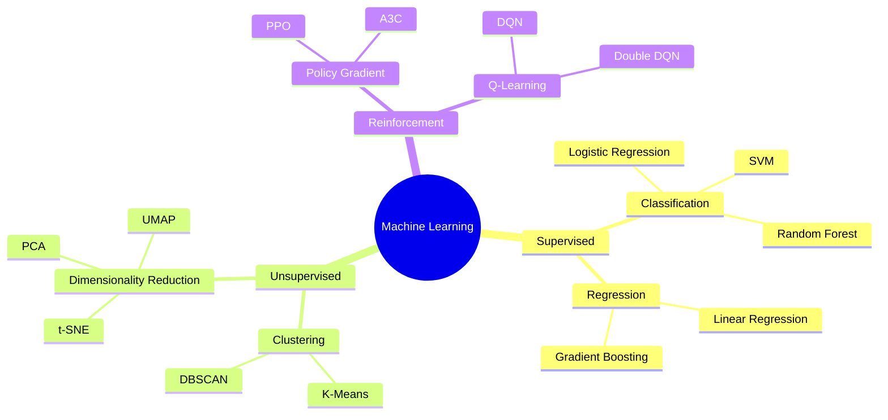

Mind maps auto-style based on depth level. Keep labels short (1-3 words).

---

## Timeline (historical or process views)

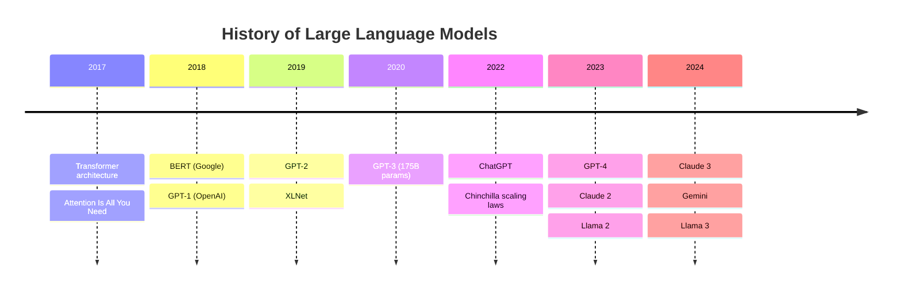

Keep timeline entries concise. Use multiple entries per year with `:` prefix.

---

## Class Diagram (data models and ontologies)

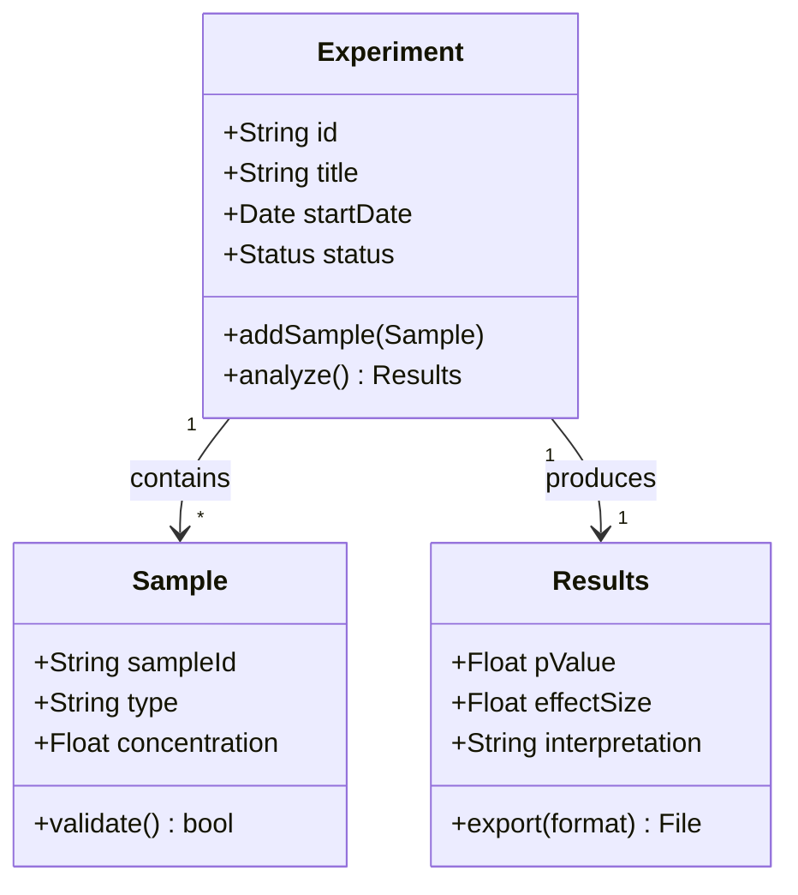

Useful for scientific data structures, database schemas, and taxonomies.

---

## State Diagram (experimental protocols)

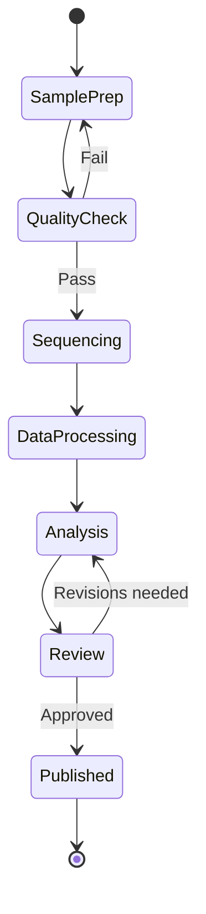

Good for showing experimental workflows with branching and loops.

---

## Comparison Layout (side-by-side)

Use flowchart LR with parallel subgraphs for comparing two approaches.

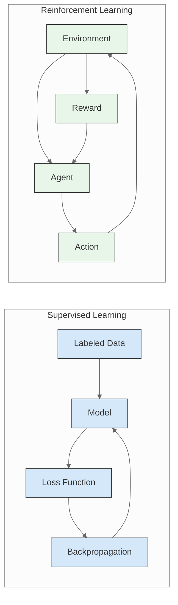

### Three-way comparison

For three approaches, stack three subgraphs vertically (TB) or use a grid layout.

---

## Syntax Quick Reference

| Feature | Syntax |
|---------|--------|
| Theme init | `%%{init: {'theme': 'neutral'}}%%` |
| Direction | `flowchart TB` / `LR` / `BT` / `RL` |
| Arrow | `A --> B` |
| Arrow with label | `A -->&#124;label&#124; B` |
| Dotted arrow | `A -.-> B` |
| Thick arrow | `A ==> B` |
| Subgraph | `subgraph "Title"` ... `end` |
| Class def | `classDef name fill:#hex,stroke:#hex,color:#hex` |
| Apply class | `class A,B className` or `A:::className` |
| Line break in text | `A[Line 1<br/>Line 2]` |
| Link multiple | `A & B --> C` |
| Comment | `%% This is a comment` |
