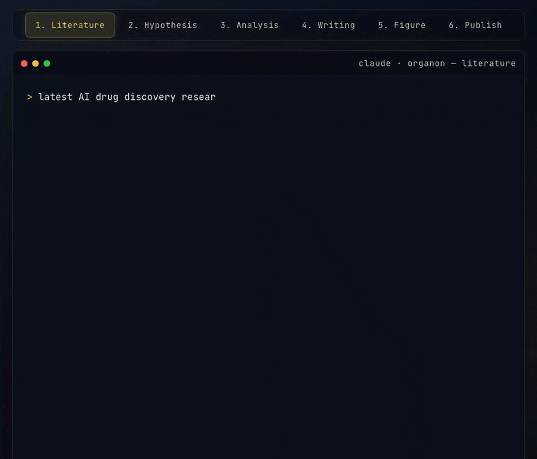

<p align="center">
  
</p>

# Organon

An Agentic OS for Scientists, built on Claude Code.

Named after Aristotle's collection of works on the tools of correct reasoning, Organon gives Claude Code personality, memory, and research skills so it works like a lab partner, not a chatbot. It remembers your research profile, learns your preferences over time, and runs proven methodologies for literature search, data analysis, hypothesis testing, manuscript writing, and science communication.

For the full design rationale and architecture, read the whitepaper: **[docs/organon-whitepaper.md](docs/organon-whitepaper.md)**.

---

## See it in action

<p align="center">
  
</p>

A single research day across six skills — literature search, hypothesis generation, data analysis, manuscript writing, figure generation, and publishing — each routed automatically, with output tailored to your research profile. Interactive version (click-through tabs, live replay): open `docs/index.html` in a browser.

---

## Quickstart

```bash
git clone https://github.com/krmdel/organon.git
cd organon
bash scripts/install.sh
```

The installer handles everything in one shot: prerequisites, system tools, Python scientific environment, skill dependencies, MCP servers, and the cron dispatcher. Safe to re-run anytime.

When it finishes, open Claude Code:

```bash
claude
```

Your first session triggers `/lets-go`, an interactive onboarding that builds your research profile from the ground up:

1. **Drop your materials.** Drag papers, manuscripts, notebooks, datasets, or reference lists into the `research_artifacts/` folder (or paste file paths directly into chat). Organon reads each file, classifies it automatically (paper vs. manuscript vs. notebook vs. dataset), and extracts structured data: your methods, tools, fields, co-authors, and key findings.

2. **Share your academic presence.** Paste links to your ORCID, Google Scholar, lab page, or GitHub. Organon scrapes them to fill in publication history, citation metrics, co-author networks, and your tool ecosystem.

3. **Answer a few questions.** Organon asks about your primary field, active research questions, preferred statistical methods, writing style, and journal targets. Answers are stored in `research_context/research-profile.md`, where every downstream skill can read them.

4. **Choose your skills.** All 31 skills are installed by default. You pick which ones to keep. The rest are removed cleanly.

The result is a research profile that makes every skill output personalized: literature summaries highlight relevance to *your* work, data analysis defaults to *your* preferred tests and plot styles, writing matches *your* field conventions.

You only do this once. Every future session starts with a quick context reload (memory, learnings, open threads from last time) and you're working immediately.

---

## What You Get

Organon is built on three layers:

1. **Agent Identity:** Personality (SOUL.md), your profile (USER.md), and session memory. This is what makes it feel like working with someone who knows your research.

2. **Skills:** Modular capabilities that can be added or removed. Each skill follows a tested methodology and self-improves as you give feedback.

3. **Research Context:** Your research profile, field expertise, and preferences. Skills load only what they need, so output stays focused and relevant to your domain.

### It gets smarter over time

Organon has a built-in learning loop. After every deliverable, it asks "How did this land? Any adjustments?" Your feedback is logged to `context/learnings.md` under the skill that produced it. Next time that skill runs, it reads its own learnings section before starting.

This means corrections compound:

- Tell `sci-data-analysis` you prefer violin plots over box plots, and it defaults to violin plots from then on.
- Tell `sci-writing` your field uses passive voice in methods sections, and future drafts follow that convention.
- Tell `viz-nano-banana` you like minimalist pathway diagrams, and it suggests that style first next time.
- Tell `sci-communication` your blog voice is conversational and direct, and it adjusts tone accordingly.

Learnings are split into two levels. Skill-specific feedback goes under `## {skill-name}` (only that skill reads it). Cross-cutting insights go under `# General` (visible to all skills). Over sessions, the general section accumulates patterns like "parallel subagents before planning produces tighter implementation plans" or "HTTP MCP transports with auth gates are brittle; prefer CLI installs."

Session memory works on a shorter timescale. Each day gets a file in `context/memory/` with numbered session blocks tracking goals, deliverables, decisions, and open threads. When you return the next day, Organon reads yesterday's open threads and picks up where you left off without you having to re-explain context.

### Multi-agent architecture

Organon is not a single prompt talking to an LLM. It is a coordinated system of specialized agents, each with a defined role, isolated context, and strict handoff protocols.

**The paper pipeline** is the clearest example. When you say "draft an introduction about X," four agents run in sequence:

1. **sci-researcher** builds a numbered evidence table, generates a `.bib` file, and produces a quotes sidecar with source-anchored candidate passages from real papers.
2. **sci-writer** drafts the section using only the evidence table. Every claim must use a `[@Key]` citation marker that maps to the `.bib`. The writer never sees the verifier's rules.
3. **sci-verifier** runs mechanical checks (DOI validation against CrossRef, citation marker syntax, hedging analysis, statistical reporting) and semantic checks (does each quote actually appear in the cited paper?). It reads the draft cold, with no memory of the writing process.
4. **sci-reviewer** performs an adversarial audit, producing FATAL/MAJOR/MINOR findings with inline annotations. It also reads the draft cold.

The context isolation is deliberate. When one agent both writes and verifies in the same context window, it learns to hedge just enough to pass its own checks rather than being genuinely accurate. Separate agents force honest evaluation. The verifier cannot be gamed because it never saw the writing prompt.

On top of the pipeline, a **PreToolUse hook** (`verify_gate.py`) intercepts every file write to manuscript directories and blocks the save if it detects fabricated citations or unsupported claims. This is a second, independent line of defense: even if the pipeline has a bug, no fabrication reaches disk.

**The auditor pipeline** works similarly for science communication. When you ask for a blog post or tutorial that cites research, a single `sci-auditor` agent runs verification and review in one pass, checking every claim against the upstream quotes sidecar.

**Skill routing** is itself an agent coordination pattern. When you type a request, the orchestrator (CLAUDE.md) matches your phrasing against trigger patterns across 31 skills, prints a routing notice showing which skill was selected and why, then hands off execution. If a skill needs another skill mid-execution (e.g., `sci-communication` calling `tool-paperclip` for full-text citations, then `viz-nano-banana` for inline illustrations), it prints a second routing notice and delegates. The user sees the chain of decisions transparently.

**Background agents** handle scheduled work. The cron dispatcher runs prompts on a schedule via headless `claude -p` invocations: paper alerts, citation tracking, data monitoring, weekly digests. Each job is a markdown file in `cron/jobs/` with a schedule expression and a prompt. The watchdog ensures the dispatcher stays alive.

**GSD project management** adds another layer of agent coordination for complex multi-step projects. It spawns parallel research agents before planning, uses separate planner and executor agents, and runs verification agents after execution to confirm the work actually achieved the goal.

The result is a system where no single agent does everything. Each agent is small, focused, and testable. The orchestration layer (CLAUDE.md + pipeline state machines + hooks) ensures they work together reliably.

---

## Science Skills

| Skill | What it does |
|-------|-------------|
| `sci-research-profile` | Build your researcher identity: field, interests, tools, style |
| `sci-literature-research` | Search PubMed, arXiv, OpenAlex, Semantic Scholar; summarize papers; generate BibTeX |
| `sci-data-analysis` | Load, clean, analyze, and visualize data; statistical tests (t-test, ANOVA, chi-square, correlation) |
| `sci-hypothesis` | Generate hypotheses from data patterns; design experiments with power analysis; validate on an evidence spectrum |
| `sci-writing` | Draft manuscript sections; format citations; AI peer review |
| `sci-communication` | Blog posts, tutorials, lay summaries, social threads, press releases from any source |
| `sci-trending-research` | What's trending in science: publication surges, Reddit/X discussions, preprint activity |
| `sci-research-mgmt` | Research notes, project tracking with milestones, automated pipelines |
| `sci-tools` | Browse 2,200+ biomedical tools from Harvard's ToolUniverse catalog |
| `sci-council` | Spawn 3 parallel expert personas (Gauss, Erdős, Tao) for adversarial research review |
| `sci-optimization` | Linear programming, column generation, cutting planes, competition math |
| `sci-optimization-recipes` | Named optimization recipes: Dinkelbach, variable neighborhood, Remez exchange, and more |

---

## Visualization Skills

| Skill | What it does | API key needed |
|-------|-------------|----------------|
| `viz-diagram-code` | Mermaid diagrams: flowcharts, sequence, architecture, mind maps, timelines | — |
| `viz-presentation` | Slide decks from markdown via Marp: PDF, PPTX, HTML output | — |
| `viz-excalidraw-diagram` | Hand-drawn style architecture and workflow diagrams | — |
| `viz-nano-banana` | AI image generation in 6 styles including scientific illustration | `GEMINI_API_KEY` |

---

## Utility Skills

| Skill | What it does | API key needed |
|-------|-------------|----------------|
| `tool-humanizer` | Strip AI writing patterns from any output | — |
| `tool-firecrawl-scraper` | Scrape JS-heavy websites and extract content | `FIRECRAWL_API_KEY` |
| `tool-youtube` | Pull YouTube transcripts and channel listings | `YOUTUBE_API_KEY` (channel mode only) |
| `tool-substack` | Push markdown blog posts to Substack as drafts with image upload | `SUBSTACK_SESSION_TOKEN` |
| `tool-gdrive` | Stage deliverables to Google Drive for sharing and backup | — |
| `tool-obsidian` | Save knowledge artifacts to your Obsidian vault | — |
| `tool-paperclip` | Full-text search across 8M+ biomedical papers (bioRxiv, medRxiv, PMC) | OAuth (one-time) |

---

## Meta Skills

| Skill | What it does |
|-------|-------------|
| `meta-skill-creator` | Build custom skills for your research workflow |
| `meta-wrap-up` | End-of-session memory and learning capture |

---

## Einstein Arena Skills

Organon includes a full autonomous attack pipeline for [Einstein Arena](https://arena.rhizomic.ai/) math and optimization challenges.

| Skill | What it does |
|-------|-------------|
| `tool-arena-attack-problem` | End-to-end autonomous campaign: recon → 5-agent research fan-out → hypothesis graph → attack → polish → tri-verify → submit |
| `tool-arena-runner` | Tactical ops: polish an existing solution, run tri-verify, check leaderboard, submit |
| `tool-einstein-arena` | Low-level API: fetch problems, register agent, submit solutions, read discussions |

**Quick start:**
```bash
# Register your agent (one-time)
python3 .claude/skills/tool-einstein-arena/scripts/register.py

# Attack a problem end-to-end
# In Claude Code: "attack the prime-number-theorem arena problem"
```

**Results:** Organon has achieved #1 rankings on multiple Einstein Arena challenges, including the First Autocorrelation Inequality (C1), a classical optimization problem (C3), and the Prime Number Theorem (PNT) challenge.

---

## Ops Skills

| Skill | What it does |
|-------|-------------|
| `ops-cron` | Schedule recurring research jobs: paper alerts, citation tracking, data monitoring |
| `ops-ulp-polish` | Float64 coordinate-descent precision polisher for breaking through 1e-13 score floors |
| `ops-parallel-tempering-sa` | Replica-exchange simulated annealing with temperature ladder for global optimization |

---

## Writing and Publishing

Organon has two writing skills that cover the full spectrum from formal manuscripts to public-facing content.

### Manuscripts (`sci-writing`)

Draft, format, and review scientific papers. Three modes:

- **Draft:** "write an introduction about X" or "draft methods for our gene expression study." Uses a 4-agent pipeline (researcher, writer, verifier, reviewer) where each agent works in isolation so the verifier can't be gamed by the writer. Every claim must trace to a real citation.
- **Format citations:** "format these citations in Nature style." Reads your `.bib` files and outputs formatted bibliographies in APA, Nature, IEEE, or Vancouver.
- **Peer review:** "review my draft" or "peer review this paper." Runs verification (DOI checks, hedging analysis, citation accuracy) followed by adversarial review with FATAL/MAJOR/MINOR findings.

The entire write path is guarded by a PreToolUse hook that blocks any manuscript save containing a fabricated citation or unsupported claim. Every quote in the final draft must trace back to a real paper via the upstream quotes sidecar from `sci-literature-research`.

### Blog Posts, Tutorials, and More (`sci-communication`)

Create outreach content from any source: a paper, a concept, a URL, a dataset, or your own expertise. Seven formats:

| Format | Example prompt |
|--------|---------------|
| **Blog post** | "write a blog post about our CRISPR findings" |
| **Tutorial** | "write a tutorial on single-cell RNA-seq analysis" |
| **Explainer** | "explain transformer attention for non-ML people" |
| **Lay summary** | "write a patient-friendly summary of this clinical trial" |
| **Social thread** | "turn this paper into a Twitter thread" |
| **Newsletter** | "weekly digest of what happened in computational biology" |
| **Press release** | "institutional press release for our Nature paper" |

Each format follows a tested methodology with field-appropriate structure. After drafting, the humanizer gate offers to strip AI writing patterns so the output reads naturally. Publishable content can be pushed directly to Substack as a draft via `tool-substack`.

---

## Presentations and Slide Decks

`viz-presentation` converts any content into professional slide decks via Marp. Feed it a topic, a blog post, a manuscript section, or a paper, and it produces presentation-ready output in PDF, PPTX, and HTML.

| Use case | Example prompt |
|----------|---------------|
| **Conference talk** | "prepare a 20-minute talk from our Nature paper" |
| **Lecture slides** | "create lecture slides about CRISPR-Cas9 mechanisms" |
| **Pitch deck** | "build a pitch deck for our drug discovery platform" |
| **Lab meeting** | "turn this week's results into lab meeting slides" |
| **Seminar** | "seminar presentation on transformer architectures in genomics" |
| **Poster** | "poster presentation for the ISMB conference abstract" |

Supports LaTeX math equations, syntax-highlighted code blocks, Mermaid diagrams (rendered inline), and speaker notes. Slides follow academic presentation conventions by default, but adapt to the format: conference talks get structured argumentation, pitch decks get concise value propositions, lectures get progressive disclosure.

Works best when combined with other skills. Generate figures with `viz-nano-banana` or `viz-diagram-code`, then reference them in the presentation. Pull key findings from `sci-data-analysis` or literature context from `sci-literature-research` to populate content-rich slides automatically.

---

## Image Generation

`viz-nano-banana` generates images via Gemini 3 Pro Image, from scientific illustrations to infographics to comic strips. The skill's value is in prompt construction: it combines tested style templates with your content description to produce consistent, high-quality output.

### Six styles

| Style | Best for | Example |
|-------|----------|---------|
| `scientific` | Publication figures, pathways, cell diagrams, schematics | "draw a MAPK signaling pathway" |
| `technical` | Architecture diagrams, annotated workflows | "visualize the data pipeline architecture" |
| `notebook` | Educational sketches, concept summaries | "sketch how PCR amplification works" |
| `comic` | Step-by-step narratives, before/after sequences | "comic strip showing the peer review process" |
| `color` | Marketing infographics, concept explainers | "infographic comparing CRISPR vs TALENs" |
| `mono` | Minimalist technical docs, dark-mode friendly | "clean black-and-white diagram of the experimental setup" |

### Scientific sub-styles

For the `scientific` style, six specialized sub-styles produce domain-appropriate output:

| Sub-style | Use case |
|-----------|----------|
| `experimental-setup` | Lab equipment layouts, protocol diagrams |
| `biological-pathway` | Signaling cascades, metabolic pathways |
| `cell-diagram` | Cell cross-sections, organelle layouts |
| `molecular-mechanism` | Protein interactions, binding events |
| `flowchart` | Process flows, decision trees, algorithms |
| `conceptual-figure` | Abstract concepts, theory frameworks, paper overview figures |

### Two generation modes

- **Direct prompt** (default): describe what you want and the skill constructs a detailed visual prompt combining style templates with spatial layout instructions.
- **SVG blueprint** (complex layouts): for precise multi-element compositions, the skill first generates an SVG layout as a blueprint, then uses it to guide the image generation.

The skill always confirms your style choice before generating. It learns your preferences over sessions. If you preferred minimalist pathways last time, it will suggest that again.

Requires a free `GEMINI_API_KEY` from [Google AI Studio](https://ai.google.dev/).

---

## Paper Search MCP Servers

Three MCP servers power literature research. They are complementary, not redundant.

**1. `paper-search` (local federated search):** a local Node MCP server at `mcp-servers/paper-search/dist/index.js` that queries four databases in parallel:

- **PubMed:** biomedical and life sciences (optional `NCBI_API_KEY` for higher rate limits)
- **arXiv:** physics, math, CS, biology preprints
- **OpenAlex:** 250M+ works across all disciplines, citation-ranked (optional `OPENALEX_API_KEY` for polite pool)
- **Semantic Scholar:** AI-powered academic search with citation context

**2. `paperclip` (HTTP MCP):** remote MCP server at `https://paperclip.gxl.ai/mcp`, configured in `.mcp.json`. Covers 8M+ full-text papers from bioRxiv, medRxiv, and PubMed Central with deep capabilities the federated search can't match: sub-second corpus-wide regex grep, hybrid BM25+vector search, per-paper LLM reading via `map`, figure analysis via `ask-image`, SQL queries on the unified `documents` table, and `citations.gxl.ai` line-anchor URLs for citation verification.

**3. `paperclip` CLI (optional fallback):** the same backend as above but via a local binary. Install if the HTTP MCP is unreachable or you want offline/scripted access:

```bash
curl -fsSL https://paperclip.gxl.ai/install.sh | bash
```

This runs device-flow OAuth and installs the binary at `~/.local/bin/paperclip`.

**How they route:** Calibrated routing rules (see `.claude/skills/sci-literature-research/references/paperclip-routing.md`). Key findings:
- **Biomedical discovery/review → BOTH, dedupe by DOI.** Paperclip surfaces recent preprints + full-text; federated (via OpenAlex citation ranking) surfaces the seminal canon. Neither alone is complete.
- **Biomedical deep capability (grep/map/figure/SQL) → paperclip only** (federated can't do these).
- **Non-biomedical queries → federated only** (paperclip returns keyword-collision noise; e.g. "gravitational waves" returns a termite paper about acoustic black holes in wood).

The `sci-literature-research`, `sci-hypothesis`, and `sci-communication` skills all follow this routing via `.claude/skills/sci-literature-research/references/paperclip-routing.md`.

### MCP server credentials

Put your keys in `.env` at the repo root. `scripts/with-env.sh` picks them up automatically when MCP servers launch. No shell-rc changes needed.

**How it works:** `.mcp.json` routes local MCP commands through `scripts/with-env.sh`, a tiny shim that sources `.env` and then `exec`s the real command. `install.sh` creates both `.env` and `.mcp.json` from their `.example` templates automatically, so cloning the repo, running `bash scripts/install.sh`, and filling `.env` is enough.

```bash
bash scripts/install.sh   # creates .env and .mcp.json from examples
# edit .env and add your keys
claude                    # MCP servers pick up the keys on launch
```

Verify with `/doctor` inside Claude Code. No "Missing environment variables" warning on `paper-search` means the shim is working. Without the keys, the MCP server runs unauthenticated and hits stricter rate limits (still functional, just slower).

**Adding a new MCP server that needs secrets?** Route it through the shim:
```json
"my-server": {
  "command": "bash",
  "args": ["scripts/with-env.sh", "node", "mcp-servers/my-server/dist/index.js"]
}
```

---

## Citation Verification

The `repro/` module provides DOI verification against CrossRef: check metadata, detect retractions, and validate references programmatically.

---

## GSD (Get Stuff Done)

GSD is a project management framework for Claude Code. It adds structured planning, execution, and verification for complex multi-step projects.

**Install GSD:**
```bash
npx get-shit-done-cc@latest
```

**Key commands:**

| Command | What it does |
|---------|-------------|
| `/gsd:new-project` | Start a new project with deep context gathering |
| `/gsd:plan-phase` | Plan a phase with research, task breakdown, and verification |
| `/gsd:execute-phase` | Execute a plan with atomic commits and state tracking |
| `/gsd:progress` | Check where you are and what's next |
| `/gsd:debug` | Systematic debugging with persistent state |
| `/gsd:quick` | Quick task with GSD guarantees (commits, tracking) |
| `/gsd:help` | See all available commands |

---

## Managing Skills

```bash
bash scripts/list-skills.sh                      # See what's installed and available
bash scripts/add-skill.sh sci-hypothesis          # Add a skill
bash scripts/remove-skill.sh viz-nano-banana      # Remove a skill
```

Dependencies are resolved automatically.

---

## Updating

```bash
bash scripts/update.sh        # check for updates, pull safely, preserve your data
bash scripts/update.sh --check   # just check, don't update
```

The update script backs up your user data (USER.md, learnings, research notes, cron state), pulls the latest framework changes, and restores everything automatically. If you've modified framework files (skills, scripts), they're stashed and can be re-applied with `git stash pop`.

Some files are also gitignored and never touched by any update: `.env`, `context/memory/`, `research_context/`, `projects/`, `.planning/`.

---

## API Keys

Most skills work without any API keys. Some are enhanced with external services. All keys go in your `.env` file.

| Service | Key | Used by | Without it |
|---------|-----|---------|------------|
| Firecrawl | `FIRECRAWL_API_KEY` | `tool-firecrawl-scraper`, `sci-communication` | Falls back to WebFetch |
| OpenAI | `OPENAI_API_KEY` | `sci-trending-research` | Falls back to WebSearch |
| xAI | `XAI_API_KEY` | `sci-trending-research` | Falls back to WebSearch |
| YouTube | `YOUTUBE_API_KEY` | `tool-youtube` | Transcript mode still works |
| Gemini | `GEMINI_API_KEY` | `viz-nano-banana` | Image generation unavailable |

To see every available key with descriptions:

```bash
cat .env.example
```

---

## Scheduled Jobs (Cron)

Run tasks automatically in the background: paper alerts, citation tracking, data monitoring. Drop a markdown file into `cron/jobs/`, install the dispatcher once, and your prompts run on schedule.

### Install the dispatcher

```bash
bash scripts/install-crons.sh          # Mac
powershell scripts/install-crons.ps1   # Windows
```

### Pre-built science jobs

| Job | What it does |
|-----|-------------|
| `science-paper-alerts` | Monitor new papers in your research areas |
| `science-citation-tracker` | Track citations of your publications |
| `science-data-monitor` | Watch datasets for updates |
| `science-deadline-reminders` | Conference and grant deadline alerts |
| `science-weekly-digest` | Weekly research field summary |

Or ask Claude: "schedule a job to check for new CRISPR papers every morning." The `ops-cron` skill handles the rest.

### Manage jobs

| Action | How |
|--------|-----|
| **Pause a job** | Set `active: "false"` in the job file |
| **Run a job now** | `bash scripts/run-job.sh {job-name}` |
| **Check logs** | `cat cron/logs/{job-name}.log` |
| **Remove dispatcher** | `bash scripts/uninstall-crons.sh` |

Full schedule reference: `cron/templates/schedule-reference.md`

---

## Multiple Clients / Labs

Work with multiple research groups from a single install:

```bash
bash scripts/add-client.sh "Genomics Lab"
cd clients/genomics-lab
claude
```

Each client has its own research profile, memory, and output. Methodology and skills are shared from the root.

For the full setup guide, see [docs/multi-client-guide.md](docs/multi-client-guide.md).

---

## File Structure

```
organon/
├── context/
│   ├── SOUL.md            <- Agent personality and behaviour rules
│   ├── USER.md            <- Your preferences and working style
│   ├── learnings.md       <- Accumulated skill feedback
│   └── memory/            <- Daily session logs
├── research_context/      <- Your research profile
├── .claude/skills/        <- Installed skill packs
├── mcp-servers/
│   └── paper-search/      <- Federated literature search server
├── repro/                 <- Citation verification module
├── research/              <- Research data directories
│   ├── notes/             <- Research notes
│   ├── experiments/       <- Experiment logs
│   ├── pipelines/         <- Automated pipeline definitions
│   └── projects/          <- Research project tracking
├── cron/
│   ├── jobs/              <- Scheduled job definitions
│   └── templates/         <- Job templates and reference
├── projects/              <- All generated output
├── scripts/               <- Install, update, manage skills
├── docs/                  <- Whitepaper, guides, and cheat sheetf
└── CLAUDE.md              <- Agent orchestration
```

---

## Quality of Life

- **CC Notify:** native OS notifications when Claude finishes a task or needs input
- **Auto-download:** binary outputs (images, PDFs, slides) auto-copy to Downloads
- **Humanizer gate:** publishable text automatically stripped of AI writing patterns
- **Clickable file paths:** every saved file shows the full path to click and open
- **Graceful degradation:** no skill breaks because something is missing

---

## Your Data is Safe

**Gitignored (never touched by git):**
- **.env:** your API keys
- **context/memory/:** daily session logs
- **research_context/:** your research profile
- **projects/:** everything the system generates
- **.planning/:** GSD project state

**Protected by `scripts/update.sh` (backed up and restored on every update):**
- **context/USER.md:** your preferences and working style
- **context/learnings.md:** accumulated skill feedback
- **research/notes/**, **research/experiments/**, **research/projects/:** your research data
- **cron/status/**, **cron/watchdog.state.json:** scheduler state

Always update via `bash scripts/update.sh` to keep your data safe.

---

## License

MIT

---

Built with Claude Code
