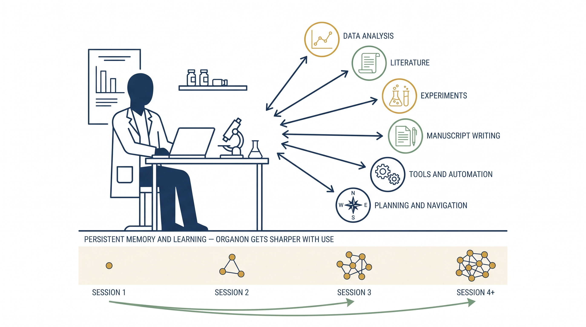
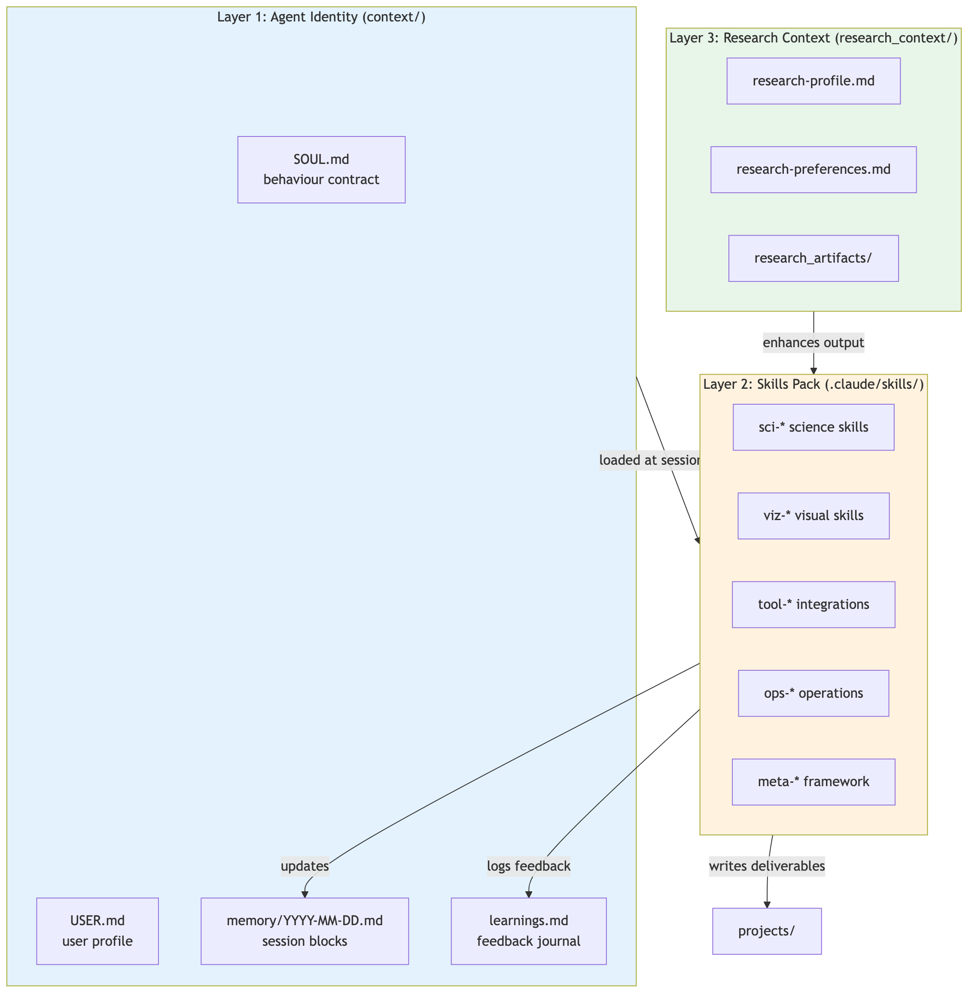
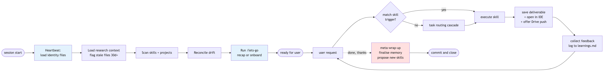
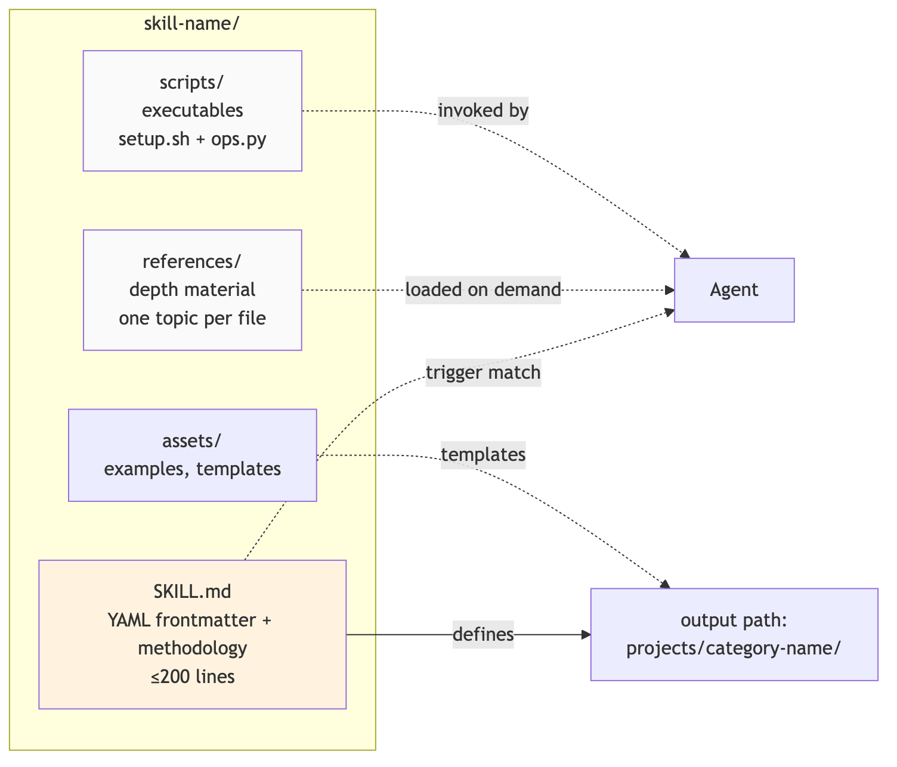
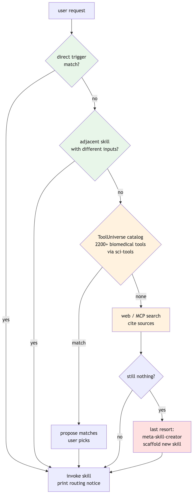
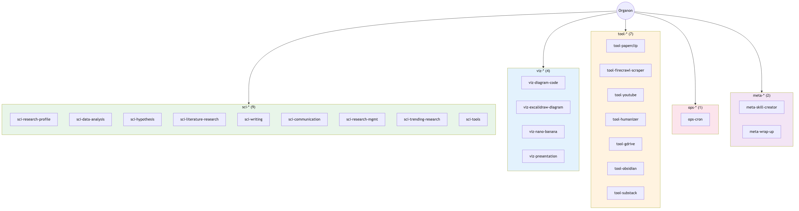
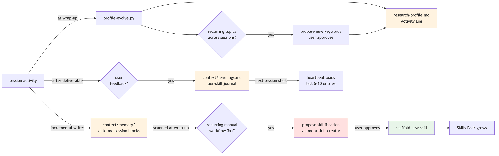
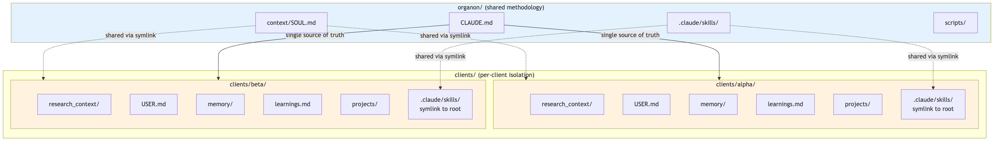

<div class="title-block">

# Organon

<p class="subtitle">An Agentic Operating System for Scientists</p>

</div>


## Abstract

Organon is an open-source framework that turns a general-purpose code agent into a persistent research assistant. It is not a chatbot. It ships as a directory of plain-text files that a scientist's coding agent (Claude Code, plus compatible runtimes) loads at session start: a personality contract, a user profile, a dated memory, a learnings journal, and a pack of composable **skills**. Every capability (loading data, running a statistical test, searching literature, drafting a manuscript, generating a figure, scheduling a recurring job) is a skill; skills are self-contained, independently versioned, and discoverable by natural-language triggers. The framework is agnostic to the model, runs offline where possible, degrades gracefully when external services are unavailable, and learns: session wrap-up scans for repeated manual workflows and proposes turning them into new skills. Organon does not replace scientific judgment. It removes the friction between a researcher's intent and the tool that realises it.



## 1. Introduction

### 1.1 The problem

A working scientist spends a significant fraction of their time on the glue between steps of the research cycle: loading data from a CSV, running a statistical test with the right assumption checks, finding five recent papers that support a claim, drafting a methods section, formatting citations, generating a figure, preparing a seminar deck, keeping notes across sessions. Each of these is well-understood in isolation. The glue is where time leaks.

Existing tools address fragments. Jupyter notebooks handle local data. Zotero handles references. Overleaf handles manuscripts. ChatGPT and Claude web interfaces produce prose but forget everything between sessions and cannot touch the local filesystem. Coding agents (Claude Code, Cursor) can manipulate files but are optimized for software engineering and do not understand that a scientist asking "what's in this data?" expects statistical profiling rather than a type annotation.

The gap is not another tool. It is a persistent layer above the agent that understands the shape of scientific work and composes the right pieces on demand.

### 1.2 Why an "operating system"

Organon borrows the operating-system metaphor deliberately. An OS does three things: it provides persistent identity and state across restarts, it multiplexes a core resource across many applications, and it exposes a stable programming interface that applications can extend. Organon does the same:

- **Persistent identity**: `SOUL.md` (how the agent behaves), `USER.md` (who the scientist is), `memory/` (what happened across sessions), `learnings.md` (what the agent has learned from feedback).
- **Resource multiplexing**: one Claude Code session routes requests to the right skill, loads only the relevant research context, and mediates between local files, MCP servers, and external APIs.
- **Stable programming interface**: skills follow a fixed structure (`SKILL.md` + `references/` + `scripts/`); a registered skill is reachable by trigger phrase without further ceremony.

The result is an environment where "analyse this file, then draft the results section, then make a figure of the effect size" is one conversation, not three tools.

## 2. Architecture

### 2.1 Three-layer model

Organon is organised in three layers. Each can be reasoned about, replaced, or extended independently.



<sub><sup>source: [`figures/mermaid-1.mmd`](figures/mermaid-1.mmd) · regenerate via `scripts/export-md.py`</sup></sub>

*Figure 1. Three-layer architecture. The agent identity is loaded on every session start. Skills are the execution surface. Research context personalises output without being required.*

**Layer 1: Agent Identity** is the foundation. It tells the agent who it is (`SOUL.md`), who it is helping (`USER.md`), what happened recently (`memory/`), and what it has learned from correction (`learnings.md`). Every session begins by reading these files. The agent is not stateless between sessions.

**Layer 2: Skills Pack** is the capability surface. Each skill is a directory with a `SKILL.md` file whose YAML frontmatter declares what the skill does and the natural-language triggers that invoke it. The pack grows over time; new skills can be added by the user, proposed by the agent, or shared across projects.

**Layer 3: Research Context** personalises output. It is optional. A scientist who has filled in `research_context/research-profile.md` (field, interests, preferred journals, writing conventions) gets output tailored to their domain. A user who skips it still gets useful work; the agent notes where it would improve with a profile.

Data files (`.env`, `memory/*`, `projects/*`, research context) are gitignored so the framework can be shared without leaking user-specific state.

### 2.2 Session lifecycle

Every session follows the same skeleton. The lifecycle is called the **heartbeat** and is the first thing the agent does on startup, with no user prompt required.



<sub><sup>source: [`figures/mermaid-2.mmd`](figures/mermaid-2.mmd) · regenerate via `scripts/export-md.py`</sup></sub>

*Figure 2. Session lifecycle. The heartbeat loads identity and context before the user's first request. Every deliverable produces feedback that feeds the learnings journal. Session end triggers wrap-up, which finalises memory and may propose skillifying patterns it observed.*

Three properties of the lifecycle deserve emphasis.

1. **The agent starts with a warm cache of who you are.** It reads yesterday's open threads, today's existing session block, the last five to ten learning entries, and the research profile before you type anything.
2. **Routing is explicit and auditable.** Every time a skill is invoked, the agent prints a routing notice naming the matched skill and trigger. A "no match" outcome is surfaced, not silently hidden.
3. **Wrap-up is automatic.** Conversational cues such as "thanks", "done", or "that's it" trigger the `meta-wrap-up` skill, which finalises the day's session block, commits work, and scans for skillifiable patterns. The session is never closed half-recorded.

## 3. Core concepts

### 3.1 The anatomy of a skill

A skill is a directory. Organon enforces a fixed structure so that every skill can be discovered, validated, and composed without a central registry maintained by hand.



<sub><sup>source: [`figures/mermaid-3.mmd`](figures/mermaid-3.mmd) · regenerate via `scripts/export-md.py`</sup></sub>

*Figure 3. Skill anatomy. The SKILL.md file is the contract: triggers, dependencies, steps. References and scripts are loaded on demand. Output always lands under a predictable project path.*

The YAML frontmatter in `SKILL.md` declares the trigger phrases, negative triggers (what should route elsewhere), and a concise description. The body describes the methodology as a numbered sequence of steps the agent follows. References are pulled in only when needed (progressive disclosure), keeping the skill lean.

Five categories partition the current catalog:

| Prefix   | Purpose                          | Example use                      |
| -------- | -------------------------------- | -------------------------------- |
| `sci-*`  | Science and research workflows   | Data analysis, literature search |
| `viz-*`  | Diagrams, figures, presentations | Mermaid, AI illustrations, decks |
| `tool-*` | External integrations            | Drive, Obsidian, YouTube         |
| `ops-*`  | Operations and scheduling        | Cron-like watchdog for Claude    |
| `meta-*` | Framework self-management        | Skill creation, session wrap-up  |

Category prefix determines the default output path (`projects/{category}-*/`), keeping deliverables organised by kind.

### 3.2 Task routing cascade

When a user request does not directly match a skill's trigger, Organon does not immediately fall back to the base model. It follows a four-tier cascade that prefers reuse over creation.



<sub><sup>source: [`figures/mermaid-4.mmd`](figures/mermaid-4.mmd) · regenerate via `scripts/export-md.py`</sup></sub>

*Figure 4. The task routing cascade. Adjacent-skill reuse is preferred over ToolUniverse lookup, which is preferred over ad-hoc web search, which is preferred over building a new skill. "No skill match" is printed only after all tiers exhaust.*

The cascade has two effects. It prevents skill proliferation (new skills must justify themselves against existing capability plus 2200 indexed biomedical tools). And it makes every routing decision legible: a user sees which tier matched and can redirect the agent to a different tier if needed.

### 3.3 Gates

Organon composes skills via a small number of **gates**: reusable decision points that any skill can wire into. Each gate owns one concern. Current gates:

- **Humanizer Gate**: after drafting publishable text, offer to remove AI writing tells (corporate buzzwords, em-dash overuse, negative parallelisms). Recommended for blog or social content, suggested-skip for formal manuscripts.
- **Drive Push Gate**: after saving a shareable deliverable (plots, manuscripts, decks, bibliographies), offer to stage it into Google Drive via the desktop sync folder. No OAuth, zero credentials; relies on the local sync client.
- **Obsidian Sync Gate**: for knowledge artifacts (paper summaries, experiment designs, research notes), offer to write a parallel note into the user's Obsidian vault with YAML frontmatter and wikilinks. Skipped entirely if Obsidian is not installed.
- **Figure Proposal Gate**: after drafting a section of a manuscript or blog post, scan the section for claims that would be strengthened by a visual (a data trend, a mechanism, a comparison) and make one routed offer per qualifying section. Routes to `sci-data-analysis` for data plots, `viz-diagram-code` for precise Mermaid diagrams, `viz-nano-banana` for AI illustrations, or `viz-excalidraw-diagram` for hand-drawn workflows.

Gates are documented centrally (`CLAUDE.md § Output Standards`) and referenced by skills rather than duplicated. Adding a new gate is a framework-level decision; wiring an existing gate into a new skill is a one-line reference.

### 3.4 Research context and graceful degradation

Research context is the opposite of a gate. A gate is a filter every skill passes through. Context is an *enhancer* that adjusts behaviour when available and is ignored when not.

`research_context/research-profile.md` captures the scientist's field, subfields, preferred journals, citation style, writing voice, and tool ecosystem. Skills that benefit from this context load only the fields they need (the Context Matrix documents which fields each skill reads). A literature-search skill loads "field, interests, journals". A writing skill loads "field, writing style".

If the file does not exist, skills run in **standalone mode**: they produce solid generic output and note which fields would improve the result. This is an explicit design choice. Organon must be useful on first contact, not only after onboarding.

The same principle applies to external API keys. Every skill that depends on a service declares a fallback. `viz-nano-banana` uses the Gemini free tier when `GEMINI_API_KEY` is unset. `sci-trending-research` falls back to unauthenticated web search when the Reddit and X keys are missing. `tool-youtube` still produces transcripts via `yt-dlp` without the YouTube Data API. Missing credentials never break a skill; they only reduce its ceiling.

## 4. Skill catalog

The current release ships 23 skills. They partition into the categories introduced in Section 3.1.



<sub><sup>source: [`figures/mermaid-5.mmd`](figures/mermaid-5.mmd) · regenerate via `scripts/export-md.py`</sup></sub>

*Figure 5. Skill catalog. 23 skills across 5 categories. Science skills cover the full research cycle from profile through writing. Visual skills target four distinct figure types. Tools integrate external services. Meta skills manage the framework itself.*

**Science skills (`sci-*`)** cover the scientific workflow end-to-end.

- `sci-research-profile` is the foundation: an interactive onboarding that writes `research_context/research-profile.md` from a short conversation.
- `sci-data-analysis` loads CSV, Excel, or JSON, profiles the dataset, runs statistical tests with assumption checking (normality, variance equality), recommends parametric or non-parametric alternatives when assumptions fail, and produces dual-format plots (Matplotlib for publication, Plotly for interactive exploration). A **pre-analysis advisor** step inspects the dataset shape and proposes the two or three most appropriate tests before running anything.
- `sci-hypothesis` generates testable hypotheses from data patterns and literature, designs experiments with power analysis and sample-size calculations, and classifies evidence on a strong/moderate/weak spectrum.
- `sci-literature-research` searches across PubMed, arXiv, OpenAlex, and Semantic Scholar via the `paper-search` MCP server, summarises papers, extracts `.bib` citations, and analyses publication-surge trends.
- `sci-writing` drafts manuscript sections through a four-agent pipeline (researcher → writer → verifier → reviewer) with a **citation-integrity gate** that refuses any manuscript containing fabricated DOIs, missing verbatim quotes, or over-hedged claims.
- `sci-communication` produces blog posts, tutorials, explainers, lay summaries, newsletters, social threads, and press releases from papers, URLs, datasets, or personal expertise.
- `sci-research-mgmt` captures research notes, tracks projects with milestones and deadlines, schedules automated paper alerts, and orchestrates cross-skill pipelines.
- `sci-trending-research` surfaces emerging topics by combining publication surges with community discussion signals (Reddit, X, web).
- `sci-tools` browses the Harvard ToolUniverse catalog (2200+ biomedical tools) and creates new scientific skills from natural-language descriptions.

**Visualization skills (`viz-*`)**: `viz-diagram-code` (Mermaid for precise flowcharts, sequence diagrams, architectures), `viz-excalidraw-diagram` (hand-drawn visual arguments), `viz-nano-banana` (six styles of AI-generated images via Gemini), and `viz-presentation` (Marp-based slide decks with paper-to-talk mode).

**Tool integrations (`tool-*`)**: `tool-paperclip` (8M biomedical full-text papers with line-anchored citations), `tool-firecrawl-scraper` (JS-rendering web scraping), `tool-youtube` (channel listing and transcripts), `tool-humanizer` (de-AI writing), `tool-gdrive` (Drive staging via desktop sync), `tool-obsidian` (markdown notes into the user's vault), `tool-substack` (markdown to Substack draft with image upload and Mermaid pre-render).

**Operations (`ops-*`)**: `ops-cron` schedules recurring Claude Code tasks via a system-level watchdog (launchd on macOS, Task Scheduler on Windows, systemd on Linux). Jobs run headlessly via `claude -p` even when the terminal is closed.

**Meta skills (`meta-*`)**: `meta-skill-creator` scaffolds new skills from natural-language descriptions with validated templates and triggers. `meta-wrap-up` runs at session end, finalises the memory file, collects feedback, reconciles catalog drift, and proposes new skills.

## 5. The learning loop

A static framework that knows the same things on day 100 as on day 1 is not an assistant; it is a library. Organon is designed to improve with use.



<sub><sup>source: [`figures/mermaid-6.mmd`](figures/mermaid-6.mmd) · regenerate via `scripts/export-md.py`</sup></sub>

*Figure 6. The learning loop. Feedback accumulates in three places: the daily memory file, the per-skill learnings journal, and the research profile. At wrap-up, recurring patterns trigger a skillification proposal. The Skills Pack grows by observation, not only by explicit design.*

Three subsystems drive the loop.

**Memory.** `context/memory/{YYYY-MM-DD}.md` holds numbered session blocks written incrementally during work (not only at wrap-up). Each block records the goal, deliverables, decisions, and open threads. The heartbeat reads today's and yesterday's files; a cross-session search script (`scripts/memory-search.py`) retrieves older material by keyword.

**Learnings journal.** `context/learnings.md` has one section per skill, plus a `General` section for cross-skill patterns. When the user gives feedback after a deliverable ("this was too long", "use Mann-Whitney next time, not t-test"), the relevant skill logs it. Every skill reads its own section before running. A skill that mis-hedged a claim once does not make the same mistake in the next session.

**Pattern detection and skillification.** At wrap-up, `meta-wrap-up` scans the session transcript plus the last five daily memory files and the learnings journal for recurring manual workflows. A workflow counts as recurring when the same multi-step shape (specific inputs, specific outputs, predictable steps) has been performed three or more times across sessions without a matching skill handling it end-to-end. When such a pattern is detected, the agent proposes: here is the shape, here is a plausible skill name, here are likely triggers; should I scaffold it via `meta-skill-creator`, queue it for next session, or skip? The user decides. Nothing is auto-built.

This is the key self-evolving property. The capability surface is not fixed at framework release; it adapts to how the user actually works.

## 6. Multi-client architecture

Organon is designed for solo researchers and can also be run by an individual supporting several research groups, companies, or collaborators.



<sub><sup>source: [`figures/mermaid-7.mmd`](figures/mermaid-7.mmd) · regenerate via `scripts/export-md.py`</sup></sub>

*Figure 7. Multi-client architecture. The root directory holds shared methodology (skills, conventions, scripts). Each client folder has its own memory, learnings, research context, and project outputs, with a symlink to the shared skills pack so methodology updates propagate instantly.*

The root directory (`organon/`) holds the shared methodology: the CLAUDE.md routing rules, the SOUL.md behaviour contract, the skills pack, and the installer scripts. Each client gets a folder under `clients/{slug}/` with its own research context, memory, learnings, and projects. Skills are shared via symlinks on Unix (so a fix or new skill at the root propagates instantly to every client) and copied on Windows (re-run `add-client.sh` to refresh).

Working with a client is a directory change and a session start: `cd clients/alpha && claude`. The heartbeat loads that client's identity. There is no context bleed between clients.

Solo users can ignore the `clients/` directory entirely.

## 7. External integrations

Organon talks to three categories of external services: MCP servers, HTTP APIs, and local tooling.

**MCP (Model Context Protocol) servers** are declared in `.mcp.json` and launched by the agent runtime. The current release ships three:

- `paperclip` (HTTP) for biomedical full-text search at `paperclip.gxl.ai`, with line-anchored citation URLs.
- `paper-search` (local node) for federated PubMed, arXiv, OpenAlex, and Semantic Scholar search, launched via a small shim (`scripts/with-env.sh`) that sources the repository `.env` file before exec so API keys are always picked up.
- `tooluniverse` (uvx) for the Harvard ToolUniverse catalog.

**HTTP APIs** are opt-in. Each is listed in the Service Registry with its key name, which skills use it, what it enables, and what happens without it. Current keys include `FIRECRAWL_API_KEY`, `OPENAI_API_KEY`, `XAI_API_KEY`, `YOUTUBE_API_KEY`, `GEMINI_API_KEY`, `NCBI_API_KEY`, `OPENALEX_API_KEY`, and the Substack session credentials. No key is *required*: every skill has a documented fallback.

**Local tooling** is detected, never required. `tool-gdrive` detects the Google Drive desktop sync folder; if absent, the Drive Push Gate is skipped silently. `tool-obsidian` detects the vault via the `OBSIDIAN_VAULT` environment variable, Obsidian's registry, or common paths; if absent, the sync gate is skipped. The framework contracts do not assume any of these are present.

## 8. Extensibility

Three paths add new capability to Organon.

**Author a skill by hand.** Create a directory under `.claude/skills/`, add a `SKILL.md` with YAML frontmatter and a numbered step sequence, write any supporting scripts under `scripts/`, and the skill is registered on the next session start. The reconciliation step in the heartbeat auto-adds new skills to the catalog, the README, and the learnings journal, and flags any external services the new skill references so they can be added to the Service Registry.

**Scaffold a skill via `meta-skill-creator`.** Describe what the skill should do in natural language ("a skill that pulls the latest arXiv preprints in a given category and summarises them"). The meta skill generates the directory structure, a validated `SKILL.md`, example triggers, a `setup.sh`, and a test harness. The user reviews and commits.

**Accept a skillification proposal.** At wrap-up, `meta-wrap-up` may surface a repeated manual workflow it observed across sessions. Approving the proposal invokes `meta-skill-creator` with the observed shape. This is the self-evolving path.

All three converge on the same artifact: a self-contained directory that other skills can depend on, that respects the gates, and that contributes to the learnings journal over time.

## 9. Design principles

A small set of rules shapes every design decision in Organon.

1. **Agent-first, not chat-first.** The assistant has persistent identity. Memory is authoritative; the conversation is ephemeral.
2. **Composition over centralisation.** Capabilities are skills. There is no monolithic controller; routing is a cascade with explicit tiers.
3. **Local files are the source of truth.** Data lives on disk. External services are accelerators with documented fallbacks, not dependencies.
4. **Graceful degradation, always.** Missing profile, missing key, missing Obsidian: fewer features, never a failure.
5. **Defense in depth for integrity.** Scientific writing runs through a citation-integrity pipeline with four gates: CrossRef DOI verification, mechanical sidecar checks, semantic quote-claim alignment, and provenance tracing.
6. **Self-evolving by design.** The Skills Pack grows from observed user behaviour. The agent gets sharper with use.
7. **Human approval on risky changes.** The agent proposes; the user commits. New skills, profile edits beyond an Activity Log, and public pushes (Substack, Drive) all require explicit user approval.

## 10. Limitations and roadmap

Organon is early. A few limitations are worth flagging.

**Model coupling.** The reference implementation targets Claude Code; skills are written to that runtime's tool set (Read, Edit, Write, Grep, Bash, Agent). Porting to another coding agent is feasible but not yet packaged.

**No built-in evaluation harness for skills.** The existing test suite (≈1500 tests) covers skill structure, routing, and individual script behaviour, but it does not yet grade skill *quality* (how well a produced figure reads, how well a literature review scopes). An evaluation harness is on the roadmap.

**Citation integrity has corners.** The four-gate pipeline catches fabricated DOIs and missing verbatim quotes, but pure-expertise writing (explainers, whitepapers like this one) with no external citations currently routes through the same auditor and trips the bib-required check. A "pure-expertise mode" that skips Phase H cleanly is planned.

**English-first.** Skills are authored in English and assume scientific writing conventions in English. Multilingual support is not yet implemented.

Planned work over the next releases:

- A skill evaluation harness with pass/fail rubrics for each skill category.
- Pure-expertise writing mode that bypasses citation gates when no `[@Key]` markers are present.
- Visual skill quality scoring (figure readability, colour accessibility, caption-figure alignment).
- Cross-skill pipeline DSL so `sci-research-mgmt` can declare pipelines in YAML instead of prose.
- Broader runtime support beyond Claude Code.

## 11. Conclusion

Scientists already have enough tools. What they lack is a persistent assistant that remembers yesterday's work, understands what a research workflow actually looks like, and composes the right pieces without being asked twice. Organon is a minimal framework for that assistant: identity files, a skill pack, a routing cascade, a learning loop.

The framework is opinionated where it matters: persistent identity, composable skills, defense in depth for citation integrity. It is unopinionated where the user should decide: which skills to enable, which APIs to provide, which deliverables to share. Small enough to read end-to-end. Large enough to be useful on day one. Built to grow by observation.

Organon is open source. Contributions of skills, gates, MCP integrations, and documentation are welcome.

---

## Appendix A: Reading the framework

The canonical entry points for anyone wanting to understand or extend Organon:

| File                              | What it is                                                 |
| --------------------------------- | ---------------------------------------------------------- |
| `CLAUDE.md`                       | The heartbeat, routing rules, gates, service registry      |
| `context/SOUL.md`                 | Agent behaviour contract (read at every session start)     |
| `.claude/skills/_catalog/catalog.json` | Machine-readable skill registry with category + dependencies |
| `.claude/skills/{name}/SKILL.md`  | Per-skill contract and numbered methodology                |
| `scripts/install.sh`              | Single-command bootstrap for a fresh clone                 |
| `tests/`                          | Structural, unit, and e2e tests (pytest)                   |

## Appendix B: Minimum viable setup

A fresh install runs three commands:

```bash
git clone https://github.com/krmdel/organon.git && cd organon
bash scripts/install.sh
claude                          # or the user's compatible coding agent
```

The heartbeat runs automatically on session start. First-run onboarding through `/lets-go` creates `USER.md` and offers to build `research_context/research-profile.md`. Everything else is optional.
